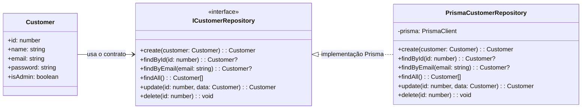
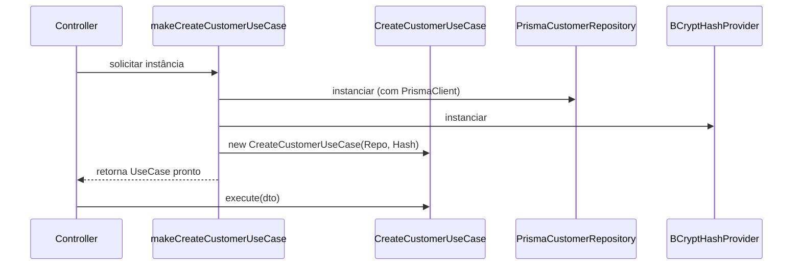
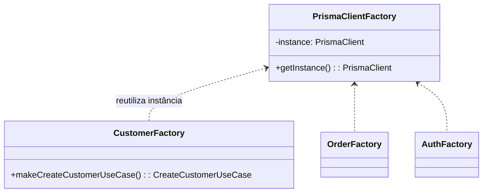

# TP – Etapa 2: Padrões de Projeto + UML

Documento para apresentar durante a etapa 2 do trabalho de Engenharia de Software (modelagem UML + código com padrões). Reúne três padrões efetivamente utilizados no projeto, cada um acompanhado de um diagrama Mermaid e referências ao código, além de um exemplo de code smell identificado e sua refatoração sugerida.

> **Dica:** abra este arquivo com um preview Markdown compatível com Mermaid (VS Code + extensão, GitHub, Mermaid Live Editor ou `npx @mermaid-js/mermaid-cli`) para visualizar os diagramas.

---

## 1. Repository Pattern

**Objetivo:** isolar o domínio dos detalhes de persistência, permitindo substituir a tecnologia de banco sem tocar nas regras de negócio.

- Contrato no domínio: `src/core/domain/repositories/customer.repository.interface.ts:1`
- Implementação/Adapter: `src/infrastructure/database/prisma/repositories/prisma-customer.repository.ts:1`
- Consumo pelo caso de uso: `src/core/application/use-cases/customer/create-customer.use-case.ts:23`



---

## 2. Factory / Composition Root

**Objetivo:** centralizar a montagem dos casos de uso, garantindo injeção consistente das dependências (repositories, providers, configs) e facilitando testes/mocks.

- Factory: `src/composition/factories/customer-use-case.factory.ts:16`
- Dependências injetadas: `PrismaCustomerRepository`, `BCryptHashProvider`
- Uso pelos controllers: `src/infrastructure/http/controllers/customer.controller.ts:16`



---

## 3. Adapter Pattern (Ports & Adapters)

**Objetivo:** desacoplar entradas HTTP das regras de negócio. O controller atua como adapter que converte `NextRequest` em DTOs compreensíveis para os casos de uso e transforma respostas `Either` em `NextResponse`.

- Adapter de entrada: `src/infrastructure/http/controllers/customer.controller.ts:16`
- Caso de uso (porto): `src/core/application/use-cases/customer/create-customer.use-case.ts:23`
- Adapter de saída (repository Prisma): `src/infrastructure/database/prisma/repositories/prisma-customer.repository.ts:1`

```mermaid
flowchart LR
    request["Next.js Route Handler\nPOST /api/v1/customers"]
    adapter["CustomerController.create\n(Adapter de entrada)"]
    port["CreateCustomerUseCase\n(Porto/Application)"]
    repo["ICustomerRepository\n(interface)"]
    prismaAdapter["PrismaCustomerRepository\n(Adapter de saída)"]
    db["PostgreSQL"]

    request --> adapter --> port
    port -- usa --> repo
    repo <|.. prismaAdapter
    prismaAdapter --> db
```

---

## Code Smell Identificado + Refatoração

- **Smell:** *Resource Management Smell* – cada factory (`customer`, `order`, `auth`, etc.) instancia seu próprio `PrismaClient` (`src/composition/factories/customer-use-case.factory.ts:16`, `src/composition/factories/auth-use-case.factory.ts:11`). Isso pode saturar conexões com o banco em produção e torna difícil compartilhar transações.
- **Refatoração sugerida:** aplicar o padrão **Singleton/Service Locator leve** para o `PrismaClient`. Criar `src/infrastructure/database/prisma/client.ts` exportando uma instância única e importá-la nas factories. Benefícios: menor consumo de recursos, reutilização de conexões e ponto único para configurar middlewares/telemetria do Prisma.



Com isso, além de evidenciar os padrões pedidos, você também demonstra preocupação com qualidade de código e manutenção contínua, atendendo ao requisito do trabalho sobre bad smells/refatorações.
